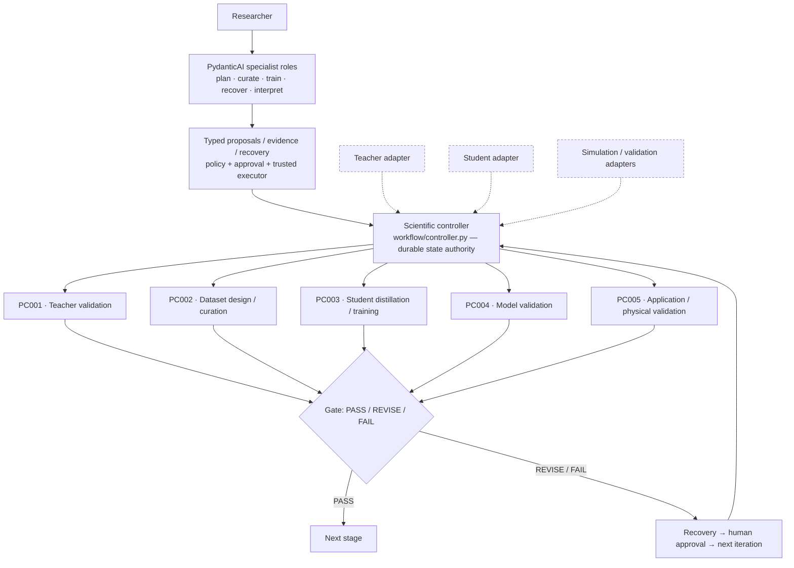

# PydanticAI Multi-Agent Framework for MLIP Distillation

[](https://github.com/DDMM-dgist/proj-multi-agent-distillation/actions/workflows/ci.yml)

A multi-agent scientific workflow for **machine-learning interatomic potential (MLIP)
distillation**. A pretrained **Teacher** MLIP is first evaluated, then used to label a curated
ensemble of atomic structures; a lighter **Student** MLIP is trained on those labels and validated
against the Teacher and against independent DFT. Five deterministic stages (**PC001–PC005**) run
under an authoritative controller that records state, hashes artifacts, and gates progress on a
three-judge review. A team of **PydanticAI specialist roles** assists with planning, data curation,
training, recovery, and evidence interpretation — but the scientific state, gate decisions, and
provenance are owned by deterministic code, not by a language model. All architecture-specific MLIP
logic is isolated behind **adapters and config**, so the core workflow never names a particular
Teacher or Student architecture.

> This is a *methodology/workflow* framework. It is validated as an **implementation** on one real
> Teacher→Student case (SiO₂ Allegro→SIMPLE-NN). It is **not** a claim that any given MLIP
> architecture is scientifically converged, nor that the workflow is universal across all
> architectures — see [Status](#status) and [Known limitations](#known-limitations).

---

## Status

| Aspect | State |
|---|---|
| Core workflow implementation | **Complete for the current milestone** |
| Seven-role PydanticAI runtime | **Implemented** |
| PC001–PC005 deterministic controller | **Implemented** |
| Reference real end-to-end run (SiO₂ Allegro → SIMPLE-NN) | **Executed** |
| Architecture-independent handoff | **Pass** |
| External / different-architecture real campaign | **Not yet demonstrated** |
| SiO₂ 20-epoch DEV Student scientific convergence | **Not claimed** |

`IMPLEMENTATION_READY_FOR_EXTERNAL_RESEARCH_GROUP = TRUE`

**Portability on a second real MLIP architecture has not yet been scientifically demonstrated.**
The framework is designed to be architecture-independent and passes an architecture-independence
check, but the only real Teacher→Student campaign executed to date is the SiO₂ reference case. The
words *universal* and *fully general* are deliberately avoided until a second architecture has been
run as a full scientific campaign.

---

## How it works



- **`workflow/controller.py` is the authoritative, durable scientific state authority.** It records
  stage state, attempts, logs, artifact hashes, and gate results under `runs/<CAMPAIGN_ID>/`, and
  blocks a stage until every earlier stage has a recorded PASS.
- The **Teacher / Student / simulation / validation adapters** are the *only* architecture-specific
  boundary. Everything to the left of them is model-agnostic.
- The PydanticAI roles never execute arbitrary shell or writes; they emit **typed proposals** that
  must clear policy, approval, and a trusted executor before anything runs.

### The seven PydanticAI roles

| Role | Responsibility | Mode | Key execution limit |
|---|---|---|---|
| **Orchestrator** | Drives the campaign, asks the researcher, serializes controller state | proposes / coordinates | Only role that may mutate controller state; still bound by every approval boundary |
| **Literature** | Gathers literature and candidate validation criteria | analyzes | Read/research only; no producer execution |
| **Data Curator** | Acquisition, Teacher labeling, split, provenance | proposes | Producer actions are typed and approval/executor-gated |
| **ML Trainer** | Student committee training and evaluation | proposes | Training is costly → approval-gated |
| **Simulation** | MD, DFT, physical-validation observables | proposes | DFT / production MD are costly/irreversible → approval-gated |
| **Analyst** | Interprets the error channels and physical observables | analyzes | Interpretation only; cannot change gate verdicts |
| **Judge** | Independent gate evaluation, votes PASS / REVISE / FAIL | judges | Three independent judges; advisory over — never overriding — deterministic facts |

Agents do **not** have unrestricted shell/write access. Every producer action is a typed
`ActionProposal` that passes policy, human-approval boundaries, and the trusted-executor layer.

### Agent-runtime frontends

The scientific workflow, roles, and contracts are **runtime-neutral** — the canonical role
instructions live in `agents/*.md` and their capabilities/contracts in `agent_specs/*.yaml`, and no
core module calls an LLM provider. Any frontend can drive a campaign by loading those specs,
isolating specialist contexts, and returning contract-shaped results to the Orchestrator (see
[`runtimes/README.md`](runtimes/README.md)).

**Claude Code is the packaged reference frontend.** After cloning, launch it in the repository root
and start (or resume) a distillation run through the bundled skills:

```text
/distill-start      # begin a new distillation campaign (the Orchestrator asks for what it needs)
/distill-status     # inspect an in-progress campaign
/distill-resume     # continue an existing campaign in a fresh session
```

You can also just describe the task in natural language. The frontend owns model authentication and
context creation; the repository owns the roles, contracts, controller state, and evidence. Other
frontends (the optional PydanticAI runtime, Codex, or manual file exchange) use the same specs.

---

## The scientific workflow (PC001–PC005)

`PC001–PC005` are the conceptual scientific stages. A concrete `workflow.yaml` realizes them as
named controller stages (e.g. `teacher_baseline`, `acquisition`, `teacher_labeling`,
`dataset_split`, `training`, `evaluation`, `physical_validation`).

- **PC001 — Teacher validation.** Evaluate the pretrained Teacher *before* distillation and record
  its applicability and reference purpose. Teacher retraining/improvement is an **external
  remediation path**, not part of the default core workflow.
- **PC002 — Dataset design / curation.** Assess structure coverage against Teacher-training
  reference coverage and the application domain: defects, MD, replay, augmentation, duplicates,
  lineage. Record label source, selection rules, and mixture ratios with provenance.
- **PC003 — Student distillation / training.** Teacher labeling → Student training → committee /
  model artifacts (a multi-seed committee by default).
- **PC004 — Model validation.** Three channels kept **strictly distinct** and never merged into a
  single number:
  1. **Student vs Teacher** (distillation fidelity)
  2. **Teacher vs independent DFT** (Teacher's own accuracy baseline)
  3. **Student vs independent DFT** (Student's absolute accuracy)
- **PC005 — Application / physical validation.** Application-specific observables — e.g. RDF,
  coordination, density, MSD, diffusivity, NVE drift, stability, and other domain observables. Not
  every observable is mandatory for every system; the validation profile declares which apply.

---

## Reference implementation

**SiO₂** is the real implementation-validation reference case:

- **Teacher:** Allegro (NequIP/Allegro ASE calculator)
- **Student:** SIMPLE-NN

It was used to verify actual Teacher inference, dataset materialization, Student training, a
four-member committee, PC004 validation (all three channels), a minimal PC005, failure/recovery
routing, and provenance/controller behavior end-to-end.

> **The 20-epoch DEV Student is an implementation test model. It is NOT a scientifically converged
> SiO₂ production potential.** All DEV Student artifacts are marked
> `DEVELOPMENT_CAMPAIGN=TRUE, DEV_RUNTIME_CAP=20, SCIENTIFIC_CONVERGENCE_CLAIM=FALSE,
> FINAL_MODEL=FALSE`. No performance claim should be read from it.

Full detail: [`handoff/SIO2_IMPLEMENTATION_VALIDATION_COMPLETE.md`](handoff/SIO2_IMPLEMENTATION_VALIDATION_COMPLETE.md).

---

## Quick start

```bash
# 1. Clone
git clone https://github.com/DDMM-dgist/proj-multi-agent-distillation.git
cd proj-multi-agent-distillation

# 2. Create/activate a Python >= 3.10 environment (conda or venv)
python -m venv .venv && source .venv/bin/activate      # or: conda create -n distill python=3.10

# 3. Install the core package
pip install -e .

# 4. (Optional) install the PydanticAI runtime extra
pip install -e ".[pydantic-ai]"
```

Then, conceptually:

5. Read the handoff guide — [`handoff/HANDOFF_README.md`](handoff/HANDOFF_README.md).
6. Prepare Teacher / Student **adapters + configs** (templates in [`handoff/templates/`](handoff/templates/)).
7. Prepare your structure data (seed / source structures).
8. Define an **independent DFT holdout** if you have one (kept out of training).
9. Define a **validation profile** (observables + thresholds + reference sources).
10. Initialize a campaign and drive it through the controller.

Controller commands (verified against the current CLI):

```bash
# initialize a run from a workflow config
python -m workflow.controller init path/to/workflow.yaml runs/<CAMPAIGN_ID>

# inspect state at any time
python -m workflow.controller status runs/<CAMPAIGN_ID>

# execute one stage
python -m workflow.controller run-stage runs/<CAMPAIGN_ID> <STAGE_NAME>

# gate a completed stage (PASS requires a 3-judge vote bundle)
python -m workflow.controller gate runs/<CAMPAIGN_ID> <STAGE_NAME> --votes votes.json
```

The console-script alias `distill-run` (from `pyproject.toml`) is equivalent to
`python -m workflow.controller`.

A **network-free** end-to-end example that trains a mock Student with no external MLIP lives in
[`examples/mock/`](examples/mock/). See [`docs/USAGE.md`](docs/USAGE.md) for the full operator
workflow.

### Installation options

| Command | Installs |
|---|---|
| `pip install -e .` | Core workflow (ase, numpy, scipy, pyyaml) — no LLM dependency |
| `pip install -e ".[pydantic-ai]"` | + the provider-neutral PydanticAI runtime |
| `pip install -e ".[pydantic-ai,local-openai]"` | + a local OpenAI-compatible backend (vLLM / Ollama) |
| `pip install -e ".[pydantic-ai,anthropic]"` | + the Anthropic SDK (real Anthropic calls only) |

The PydanticAI extras are **optional**; the core workflow does not import them. Tests that need an
optional extra skip cleanly when it is absent.

---

## Adding a new MLIP architecture

A collaborator using a different Teacher/Student normally adds/configures only:

- a **Teacher adapter/config** (`configs/teacher.<name>.yaml`)
- a **Student adapter/config** (`configs/student.<name>.yaml`)
- a **validation profile** (`validation_profile.yaml`)
- a **workflow config** (`workflow.yaml`)

Start from [`handoff/ADAPTER_INTERFACE.md`](handoff/ADAPTER_INTERFACE.md) and the templates in
[`handoff/templates/`](handoff/templates/).

A new architecture should **not** normally require modifying `workflow/controller.py`, the PC001–PC005
semantics, gate semantics, provenance policy, or approval policy. **If it does, treat that as a
portability issue to evaluate** — raise it rather than silently editing the core.

---

## Data / DFT policy

The workflow distinguishes structure categories by purpose:

| Category | Meaning |
|---|---|
| `TEACHER_TRAINING_REFERENCE` | Structures the Teacher was trained on (coverage baseline) |
| `DISTILLATION_CANDIDATE` | Structures labeled by the Teacher for Student training |
| `PRODUCTION_MD` | Deployment-domain structures / trajectories |
| `INDEPENDENT_DFT_HOLDOUT` | DFT structures reserved for validation only |

**Independent DFT validation structures must remain excluded from Student training** unless the
researcher intentionally starts a *new* scientific iteration with a separate, explicit
training-anchor policy. Validation data is never silently leaked into training. Splits are made on
`parent_structure_id` so augmented children of one seed cannot straddle train/validation/test.

## Augmentation policy

Augmentation is a **Data Curator tool/policy, not a required universal step**. The `augment-atoms`
acquisition integration generates distorted structures around existing seeds; `teacher-md` generates
snapshots via a foundation Teacher. Conceptually augmentation scope is `NONE` / `SELECTIVE` / `BROAD`
per the dataset policy. The historical SiO₂ augmentation recipe is a case detail and should **not**
be copied wholesale to a new material.

## Recovery and iteration

A REVISE/FAIL does not immediately re-run compute:

```
PASS               → continue
REVISE / FAIL      → classify root cause
                   → assign responsible role
                   → generate a recovery proposal (RecoveryPlan)
                   → human approval if needed
                   → start a new iteration
                   → remediation
                   → revalidation
```

Controller commands (verify exact syntax with `--help`): `propose-recovery`, `approve-recovery`,
`start-iteration`, `verify-recovery`. A new iteration must re-execute the affected stage; the
controller checks the changed artifacts against the previous iteration and blocks a PASS if what you
promised to change is byte-identical.

## Human-approval boundary

Researchers must be involved for costly or irreversible actions, e.g.: new DFT, Teacher retraining,
large new MD, a major architecture change, or expensive HPC/data-generation runs. Small, reversible
operations inside an already-approved campaign may proceed automatically.

## Provenance / reproducibility

Each run binds or records: git revision, input hashes, artifact hashes, model identity + SHA, units,
stage state, gate history, recovery history, and run attempts. Inputs are hash-bound at `init` and
the project git revision is pinned.

> **Changing tracked code or hash-bound scientific inputs may invalidate a same-run resume and
> requires a new attempt/iteration.** A re-derived campaign is **not** a "resume" if the code/input
> identity changed.

---

## Known limitations

See [`handoff/CONTROLLER_LIMITATIONS.md`](handoff/CONTROLLER_LIMITATIONS.md). In brief:

1. **Native posthoc supersession/adoption** of an already-computed artifact after a false-negative
   gate is **not** currently a normal controller path.
2. A **second real external MLIP architecture** has not yet been executed as a full scientific
   campaign.
3. The SiO₂ R1 development campaign used **deterministic DEV attestation**, not a live semantic LLM
   Judge, for its DEV gate path.
4. The SiO₂ **DEV Student was implementation-only** and is not scientifically converged.

---

## Repository layout

```text
workflow/        authoritative run controller + state logic + common stage steps
orchestration/   typed agent exchange / task-result-vote contracts (provider-neutral)
runtimes/        agent-runtime frontends (PydanticAI runtime + Claude/Codex/manual guides)
adapters/        architecture/tool-specific execution (teacher, student, acquisition, MD, DFT)
configs/         reusable configuration + interface docs
validation/      accuracy / uncertainty / structure / dynamics validators
gates/           judge-gate rules and audit schema
agents/          runtime-neutral canonical role instructions
agent_specs/     role capabilities, IO contracts, approval boundaries
handoff/         external-group onboarding kit (start here to integrate a new architecture)
examples/        lightweight, mostly network-free examples and case fixtures
templates/       LAMMPS / DFT / student input templates
tests/           regression / contract / onboarding tests
```

## Documentation map

```text
README.md                                    ← you are here (landing page)
└── docs/USAGE.md                            ← detailed operator workflow
└── handoff/HANDOFF_README.md                ← integrate a new architecture (start here)
    ├── handoff/ADAPTER_INTERFACE.md         ← generic teacher/student/validation contracts
    ├── handoff/templates/                   ← adapter / validation / workflow templates
    ├── handoff/CONTROLLER_LIMITATIONS.md    ← current limitations
    └── handoff/SIO2_IMPLEMENTATION_VALIDATION_COMPLETE.md   ← the SiO₂ reference case
```

See also [`NOTICE.md`](NOTICE.md) (assets you must supply yourself) and
[`runtimes/README.md`](runtimes/README.md) (agent-runtime frontends).

---

## Testing

```bash
python -m unittest discover -s tests -v
```

The regression suite runs the controller, lineage/merge/split logic, arbitrary callable/command
adapters, checkpoint integrity, external-MD binding, validation manifests, uncertainty definitions,
and the mock end-to-end smoke test. Some tests **legitimately skip** when an optional extra or an
external scientific environment/model is unavailable — a skip is not a failure.

## License and citation

- **License:** no `LICENSE` file is present yet. Usage/redistribution terms are a decision for the
  repository owners; see [`NOTICE.md`](NOTICE.md) for assets that are intentionally not distributed.
- **Citation:** citation information will be added with the associated methodology/software
  publication.

## Notes

- Model checkpoints, production datasets, and run outputs are not committed to this repository.
- VASP `POTCAR` files are never distributed.
- The Teacher model/head and the DFT reference theory can differ; that difference is recorded in the
  dataset manifest and carried into result interpretation.
- Supported *interfaces* and empirically *validated architectures* are reported separately.
